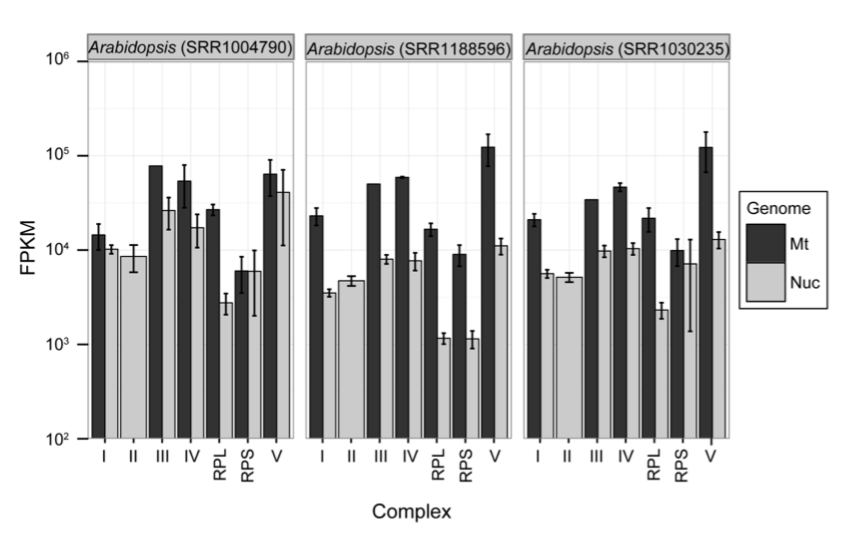
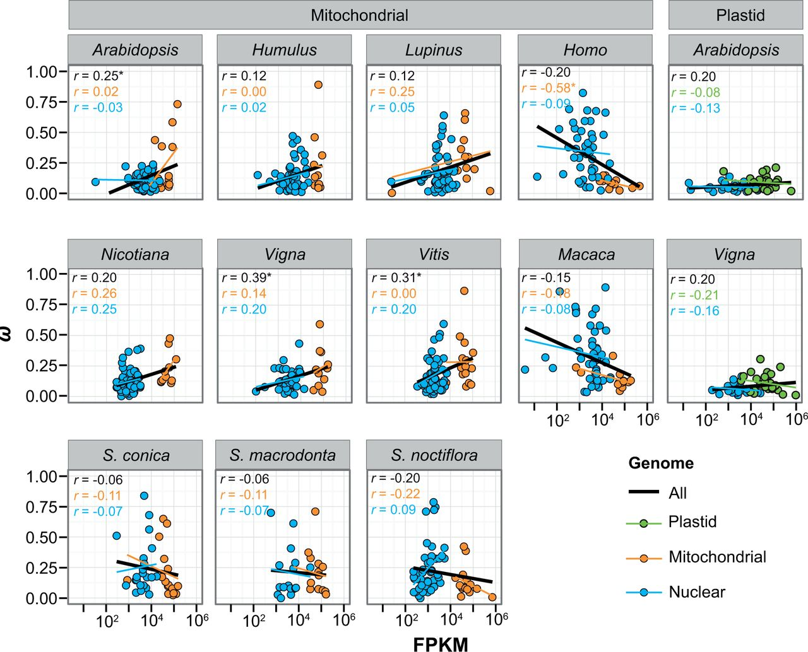

```{r setup, include=FALSE}
knitr::opts_chunk$set(
	echo = TRUE,
	warning = TRUE,
	message = TRUE,
	comment = "##",
	prompt = FALSE,
	tidy = TRUE,
	tidy.opts = list(blank = FALSE, width.cutoff = 75),
	fig.path = "img/",
	fig.align = "center"
)
```

## Introduction

The following report demonstrates various data analysis replications of figures featured in ***The Roles of Mutation, Selection, and Expression in Determining Relative Rates of Evolution in Mitochondrial versus Nuclear Genomes*** from Justin C Havird and Daniel B Sloan. This paper explores the interactions between the nuclear and mitochondrial genomes across a diverse range of species, specifically in protein complexes made up of subunits from both genomes. Two central hypotheses, nuclear compensation and selective constraints, are presented to explain the observation that mitochondrial-encoded subunits of OXPHOS enzyme complexes appear to perform more efficient selection as compared to nuclear-encoded subunits. The nuclear compensation hypothesis states that the nuclear genome will have increased selection to compensate for deleterious mutations that occur at genes in the mitochondrial genome that interact with genes in the nuclear genome. The selective constraints hypothesis states that in complexes with interacting nuclear-encoded and mitochondrial-encoded subunits, the mitochondrial subunits are of greater importance to the complex functioning and therefore will experience greater selective forces than those originating from the nucleus. These hypotheses are investigated by examining measures of mutation rate, selection, and gene expression and describing the relationships between these three variables. Ultimately, the authors found that while there is a distinctive difference between the gene expression in the two genomes, the variation in mutation rate likely holds greater importance in understanding the true reason for differences in selection rates.

## Visualization of Data

```{R}
library(tidyverse)
supp1 <- read.csv("SupplDataFile1.csv", stringsAsFactors = FALSE)
head(supp1)
supp1 %>% select(Species) %>% n_distinct()
supp1 %>% select(Gene) %>% n_distinct()
```

Supplementary Data File 1 contains the measure of transcript abundance (FPKM) for the genes examined in this paper. Observations include which of the 12 species and 229 genes is being described, the genome, the localization of the gene product, the OXPHOS complex the gene product resides in, and the transcript abundance measure. Specifically of note in this dataset are the three different sets of entries for *Arabidopsis* that were utilized to show the difference in transcript abundance across a number of varying complexes as featured in Figure S4 below.

```{R}
supp2 <- read.csv("SupplDataFile2.csv", stringsAsFactors = FALSE)
head(supp2)
supp2 %>% select(TaxonomicGroup) %>% n_distinct()
supp2 %>% select(Species.3.letter.codes.follow.KEGG.nomenclature.) %>% n_distinct()
```

Supplemetary Data File 2 contains information regarding the synonymous and non-synonymous substitution rates and the ratio between them (called ω). The ω was used in different analyses as a measure of selection. For each data entry, the taxonomic group, species, and the gene group that each measure describes is included. Additionally, the model used in conjunction with the PAML (Phylogenetic Analysis By Maximum Likelihood) program was listed. For purposes of data analysis replication, this designation helped in organizing the data to be used since those with a "0" for PAML model represented the values obtained when using a concatenated alignment for each of the taxonomic groups while those with a "1" indicated a row for an individual species. 

```{R}
supp3 <- read.csv("SupplDataFile3.csv", stringsAsFactors = FALSE)
head(supp3)
supp3 %>% select(Species) %>% n_distinct()
supp3 %>% select(Gene) %>% n_distinct()
```

Supplementary Data File 3 contains types of information presented in both of the previous data files as this dataset was used in comparing ω to FPKM, the measure of transcript abundance, across 13 species. The data includes observations for genes from nuclear, mitochondrial, and plastid genomes so comparisons of nuclear-mitochondria and nuclear-plastid relationships can be made. Furthermore, the inclusion of the transcript abundance and ω for 200 different genes allows for comparisons between species for specific genes as well analysis of the overall differences across a number of genes. 

## Replications/Reanalysis

```{R}
supp2 <- supp2 %>% 
  mutate(GeneGroup = recode(GeneGroup, "Nuc-OXPHOS" = "NucOXPHOS"),
         Lineage = case_when(TaxonomicGroup == "Rodents" ~ "Vertebrate", 
          TaxonomicGroup == "Carnivores" ~ "Vertebrate",
          TaxonomicGroup == "Primates" ~ "Vertebrate",
          TaxonomicGroup == "Bats" ~ "Vertebrate",
          TaxonomicGroup == "Cetartiodactyls" ~ "Vertebrate",
          TaxonomicGroup == "Birds" ~ "Vertebrate",
          TaxonomicGroup == "Reptiles" ~ "Vertebrate",
          TaxonomicGroup == "Amphibians" ~ "Vertebrate",
          TaxonomicGroup == "Teleosts" ~ "Vertebrate",
          TaxonomicGroup == "Corals" ~ "Invertebrate",
          TaxonomicGroup == "Dipterans" ~ "Invertebrate",
          TaxonomicGroup == "Monocots" ~ "Angiosperm",
          TaxonomicGroup == "Eudicots" ~ "Angiosperm",
          TaxonomicGroup == "Silene" ~ "Angiosperm",
          TaxonomicGroup == "Fungi (Aspergillus)" ~ "Fungi"))

supp2 %>% filter(PAMLmodel == 1 & GeneGroup != "Nuc-Glycolysis") %>%
  pivot_wider(id_cols = c(Lineage,
                          TaxonomicGroup,
                          Species.3.letter.codes.follow.KEGG.nomenclature.),
              names_from = GeneGroup, 
              values_from = c(dS, omega..dN.dS.)) %>%
  mutate(dS_ratio=dS_Mt/dS_NucOXPHOS,
         omega_ratio=omega..dN.dS._Mt/omega..dN.dS._NucOXPHOS) %>% 
  ggplot(aes(x=dS_ratio,y=omega_ratio, color=Lineage)) + 
  geom_point() + 
  geom_smooth(aes(x=dS_ratio, y=omega_ratio),
              method = "lm",
              se = FALSE,
              color = "black") + 
  scale_x_log10() + 
  scale_y_log10(breaks = c(0.10,1.0)) + 
  labs(y = "ω-mt/ω-nuc", x = "dS-mt/dS-nuc") +
  theme_bw()
```


The above replication is for Supplementary Figure 1. In the figure, the data points are colored by which phylogenetic lineage they belong to. In supplementary dataset 2, the data is organized down to which taxonomic group they belong to but not more broadly than this. By using the **dplyr** function "mutate", I was able to use the "case_when" function to create a new variable that sorted the *TaxonomicGroup* variable into these more broad categories. The same "mutate" function was also utilized to "recode" one of *GeneGroup* observation types to allow for easier manipulation of the variable.

Creation of the graph required use of **dplyr**, **tidyr**, and **ggplot2** functions. All of these packages were loaded in previously by loading **tidyverse**. The dataset was filtered to extract entries that only included the observations for individual species and those that came from mitochondrial and nuclear-OXPHOS complex genes. The "pivot_wider" function was then used to categorize the dS and ω values by whether they were the value for a mitochondrial gene or a nuclear-OXPHOS gene to allow for the ratio of these values to be plotted. These ratios were added as additional variables using "mutate". The graph was constructed using "geom_point" and "geom_smooth" from **ggplot** with the ratio of dS values on the x axis and the ratio of ω values on the y axis. Both axes were log scaled and the y-axis was restricted as shown in the original figure.


```{R}
c <- c("I", "II", "III", "IV", "RPL", "RPS", "V")

arabidopsis <- c("Arabidopsis_dataset1" = "Arabidopsis (SRR1004790)",
                 "Arabidopsis_dataset2" = "Arabidopsis (SRR1188596)",
                 "Arabidopsis_dataset3" = "Arabidopsis (SRR1030235)")

supp1 %>% slice(1:387) %>% filter(Complex %in% c) %>%
  ggplot(aes(Complex, FPKM, fill = Genome)) + 
  geom_bar(stat="summary",
           position= "dodge") +
  facet_wrap(~ Species,
             labeller = as_labeller(arabidopsis)) + 
  scale_y_continuous(trans = "log10",
                     breaks=c(100,1000,10000,100000,1000000)) +
  geom_errorbar(stat="summary",
                width=0.5,
                position="dodge") + 
  scale_fill_grey() + 
  theme_bw()
```



The above replication is for Supplementary Figure 4. Like previously, **dplyr** and **ggplot** were utilized to organize the data and create the plots, respectively. Prior to this, two vectors were created containing the complexes to be included in the figure from the *Complex* variable in supplementary dataset 1. A vector containing the full names of each of the *Arabidopsis* samples to be used in the figure was also created for later use. 

The "slice" function was first used to extract the first 387 rows from the dataset that contained the *Arabidopsis* observations that were localized in the mitochondria only. These data were then filtered to only extract rows from a specific set of complexes. The graph was then created using "geom_bar" and "geom_errorbar" in **ggplot** with *Complex* on the x axis and *FPKM* on the y axis. The bars were "dodged" and colored by *Genome* to allow for observation of the differences in gene expression by genome. "facet_wrap" was used to separate the graph into three distinct plots, one for each of the *Arabidopsis* samples. The y axis was log-scaled and the colors of the bars was made greyscale as shown in the original figure. 

```{R}
supp3 %>% ggplot(aes(log(FPKM),Omega)) +
  geom_point(aes(fill=Genome),
             color="black",
             pch=21) + 
  facet_wrap(. ~ Species, nrow=3) + 
  ylim(0.01,1) + 
  labs(y = "ω") +
  geom_smooth(aes(log(FPKM),Omega,color=Genome),
              method="lm",
              se=FALSE) +
  geom_smooth(aes(log(FPKM),Omega),
              method="lm",
              se=FALSE,
              color="black") +
  scale_color_manual(labels = c("Cp", "Mt", "Nuc"),
                     values = c("pink", "green","blue")) +
  theme_bw()
```



The above replication is for Figure 5. Unlike in the above analyses, the use of different **dplyr** functions was not necessary to organize the data prior to creation of the graphs using **ggplot**. The set of 13 graphs with *ω* on the y axis and a log transformed version of *FPKM* on the x axis was created using "geom_point" and two "geom_smooth" functions. "facet_wrap" was utilized to organize the data by *Species* and specified to include 3 rows rather than the default of four rows generated without this designation. The y-axis was restricted as described in the Materials and Methods of the paper. The "geom_smooth" functions were ordered as presented above to have the trendline for the data overall overlapping the ones generated for each *Genome*. The legend was designed as presented in the original figure.

In performing this replication, I was unable to accurately label the x-axis according to the original values rather than the log transformed values of *FPKM* so for clarity purposes, I left the axis labeled as *log(FPKM)*.

## Summary/Discussion

While I ultimately think I was successful in recreating the analyses and visuals I set out to replicate from this paper, the organization and presentation of the figures as they were laid out in the paper I drew the material from was somewhat unsuccessful in some cases. These seem to represent a lot of the "cleaning up" that must be done prior to publication. Additionally, some of the analyses performed in the original paper (specifically those for the correlation values and p-values that were displayed on some of the figures featured above) utilized versions of the data that had been manipulated to minimize the effects of outliers and differences caused by phylogenetics. While I was able to perform some of these alterations (such as in the replication of Figure 5 where the y axis was limited to reduce the effects of outliers), controlling for the phylogenetic effects was somewhat beyond my currently knowledge of R and R Studio. 

Overall, the paper and associated datasets provided most of the details necessary to replicate the results above and, as stated previously, most of the confusion or difficulty in replicating the figures was due to my still limited practice in using the tools utilized to create this report. Some discrepancies in the organization of the data did cause some confusion though that could have been remedied by more clear organization in the datasets. Specifically, in Supplementary Figure 4, the three different *Arabidopsis* datasets are not labeled in the dataset how they are later described in the Supplementary Material. However, in comparing my replication with the figure in the paper, it was simple to identify which faceted figure belonged to which sample. 

## References

Justin C. Havird, Daniel B. Sloan, The Roles of Mutation, Selection, and Expression in Determining Relative Rates of Evolution in Mitochondrial versus Nuclear Genomes, *Molecular Biology and Evolution*, Volume 33, Issue 12, December 2016, Pages 3042–3053, https://doi-org.ezproxy.lib.utexas.edu/10.1093/molbev/msw185
