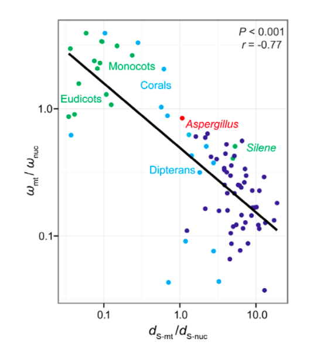

```{r setup, include=FALSE}
knitr::opts_chunk$set(
	echo = TRUE,
	warning = TRUE,
	message = TRUE,
	comment = "##",
	prompt = FALSE,
	tidy = TRUE,
	tidy.opts = list(blank = FALSE, width.cutoff = 75),
	fig.path = "img/",
	fig.align = "center"
)
```

## Introduction

[Include a summary of the paper you are reanalyzing data from]

The following report demonstrates various data analysis replication featured in ***The Roles of Mutation, Selection, and Expression in Determining Relative Rates of Evolution in Mitochondrial versus Nuclear Genomes*** from Justin C Havird and Daniel B Sloan. This paper explores the interactions and relationships between the nuclear and mitochondrial genomes across a diverse range of species, specifically in protein complexes made up of subunits from both genomes. Two central hypotheses, nuclear compensation and selective constraints, are presented to explain the observation that mitochondrial-encoded subunits of OXPHOS enzyme complexes appear to perform more efficient selection as compared to nuclear-encoded subunits. These hypotheses are investigated by examining measures of mutation rate, selection, and gene expression and describing the relationships between these three variables. 

## Visualization of Data

[Include a view of the first few lines of the data set plus exploratory data analysis - e.g., overview of descriptive statistics included in the paper, plots, etc.]

```{R}
#introduce and display using head() each of the datasets to be utilized. define the variables included in each of the files as well as their context to the goals of the paper. describe how you use the data in each of them to produce the figures featured in the below section to contextualize them. 
supp1 <- read.csv("SupplDataFile1.csv", stringsAsFactors = FALSE)
head(supp1)
#Supplementary Data File 1 contains the neasure of transcript abundance (FPKM) for the genes examined in this paper. Observations include the species the gene in question is from, the name of the gene, the genome, the localization of the gene product, the OXPHOS complex the gene product resides in, and the transcript abundance measure. Specifically of note in this dataset are the three different sets of entries for *Arabidopsis* that were utilized to show the difference in transcript abundance across a number of varying complexes as featured in Figure S4 below. 

supp2 <- read.csv("SupplDataFile2.csv", stringsAsFactors = FALSE)
head(supp2)

supp3 <- read.csv("SupplDataFile3.csv", stringsAsFactors = FALSE)
head(supp3)
```


## Replications/Reanalysis

[Be sure to explain what replications you are doing and comment your code so that it is easy for a reader to understand. Include in this section relevant tables/figures/values from the original paper for comparison to what you accomplished with your replication.]

```{R}
#Fig S1 Replication

library(tidyverse)

supp2 <- supp2 %>% 
  mutate(GeneGroup = recode(GeneGroup, "Nuc-OXPHOS" = "NucOXPHOS"),
         Lineage = case_when(TaxonomicGroup == "Rodents" ~ "Vertebrate", 
          TaxonomicGroup == "Carnivores" ~ "Vertebrate",
          TaxonomicGroup == "Primates" ~ "Vertebrate",
          TaxonomicGroup == "Bats" ~ "Vertebrate",
          TaxonomicGroup == "Cetartiodactyls" ~ "Vertebrate",
          TaxonomicGroup == "Birds" ~ "Vertebrate",
          TaxonomicGroup == "Reptiles" ~ "Vertebrate",
          TaxonomicGroup == "Amphibians" ~ "Vertebrate",
          TaxonomicGroup == "Teleosts" ~ "Vertebrate",
          TaxonomicGroup == "Corals" ~ "Invertebrate",
          TaxonomicGroup == "Dipterans" ~ "Invertebrate",
          TaxonomicGroup == "Monocots" ~ "Angiosperm",
          TaxonomicGroup == "Eudicots" ~ "Angiosperm",
          TaxonomicGroup == "Silene" ~ "Angiosperm",
          TaxonomicGroup == "Fungi (Aspergillus)" ~ "Fungi"))

supp2 %>% filter(PAMLmodel == 1 & GeneGroup != "Nuc-Glycolysis") %>%
  pivot_wider(id_cols = c(Lineage,
                          TaxonomicGroup,
                          Species.3.letter.codes.follow.KEGG.nomenclature.),
              names_from = GeneGroup, 
              values_from = c(dS, omega..dN.dS.)) %>%
  mutate(dS_ratio=dS_Mt/dS_NucOXPHOS,
         omega_ratio=omega..dN.dS._Mt/omega..dN.dS._NucOXPHOS) %>% 
  ggplot(aes(x=dS_ratio,y=omega_ratio, color=Lineage)) + 
  geom_point() + 
  geom_smooth(aes(x=dS_ratio, y=omega_ratio),
              method = "lm",
              se = FALSE,
              color = "black") + 
  scale_x_log10() + 
  scale_y_log10(breaks = c(0.10,1.0)) + 
  labs(y = "ω-mt/ω-nuc", x = "dS-mt/dS-nuc") +
  theme_bw()
```




```{R}
#Fig S4 Replication

genes <- c("I", "II", "III", "IV", "RPL", "RPS", "V")

arabidopsis <- c("Arabidopsis_dataset1" = "Arabidopsis (SRR1004790)",
                 "Arabidopsis_dataset2" = "Arabidopsis (SRR1188596)",
                 "Arabidopsis_dataset3" = "Arabidopsis (SRR1030235)")

supp1 %>% slice(1:387) %>% filter(Complex %in% genes) %>%
  ggplot(aes(Complex, FPKM, fill = Genome)) + 
  geom_bar(stat="summary",
           position= "dodge") +
  facet_wrap(~ Species,
             labeller = as_labeller(arabidopsis)) + 
  scale_y_continuous(trans = "log10",
                     breaks=c(100,1000,10000,100000,1000000)) +
  geom_errorbar(stat="summary",
                width=0.5,
                position="dodge") + 
  scale_fill_grey() + 
  theme_bw()
```


```{R}
#Fig 5 Replication

supp3 %>% ggplot(aes(log(FPKM),Omega)) +
  geom_point(aes(fill=Genome),
             color="black",
             pch=21) + 
  facet_wrap(. ~ Species, nrow=3) + 
  ylim(0.01,1) + 
  labs(y = "ω") +
  geom_smooth(aes(log(FPKM),Omega,color=Genome),
              method="lm",
              se=FALSE) +
  geom_smooth(aes(log(FPKM),Omega),
              method="lm",
              se=FALSE,
              color="black") +
  scale_color_manual(labels = c("Cp", "Mt", "Nuc"),
                     values = c("pink", "green","blue")) +
  theme_bw()
```


## Summary/Discussion

[How successful were you at replicating the analyses and visualizations in the study? What problems did you encounter? Why might you have encountered those problems? What details were lacking from the original study's methods that might have hampered your ability to replicate the authors' results?]

While I ultimately think I was successful in recreating the analyses and visuals I set out to replicate from this paper, the organization and presentation of the figures as they were laid out in the paper I drew the material from was somewhat unsuccessful in some cases. These seem to represent a lot of the "cleaning up" that must be done prior to publication. Additiionally, some of the analyses performed in the original paper (specifically those for the correlation values and p-values that were displayed on some of the figures featured above) utilized versions of the data that had been manipulated to minimize the effects of outliers and differences caused by phylogenetics. While I was able to perform some of these alterations (such as in the replication of Figure 5 where the y axis was limited to reduce the effects of outliers), controlling for the phylogenetic effects was somewhat neyond my currently knowledge of R and R Studio. 
Overall, the paper provided most of the details necessary to replicate the results above and, as stated previously, most of the confusion or difficulty in replicating the figures above was due to my still limited practice in using the tools utilized to create this report. Some discrepancies in the organization of the data did cause some confusion though that could have been remedied by more clear organization in the datasets. Specifically, in Supplementary Figure 4, the three different *Arabidopsis* datasets are not labeled in the dataset how they are later described in the Supplementary Material. However, in comparing my replication with the figure in the paper, it was simple to identify which faceted figure belonged to which sample. 

## References

